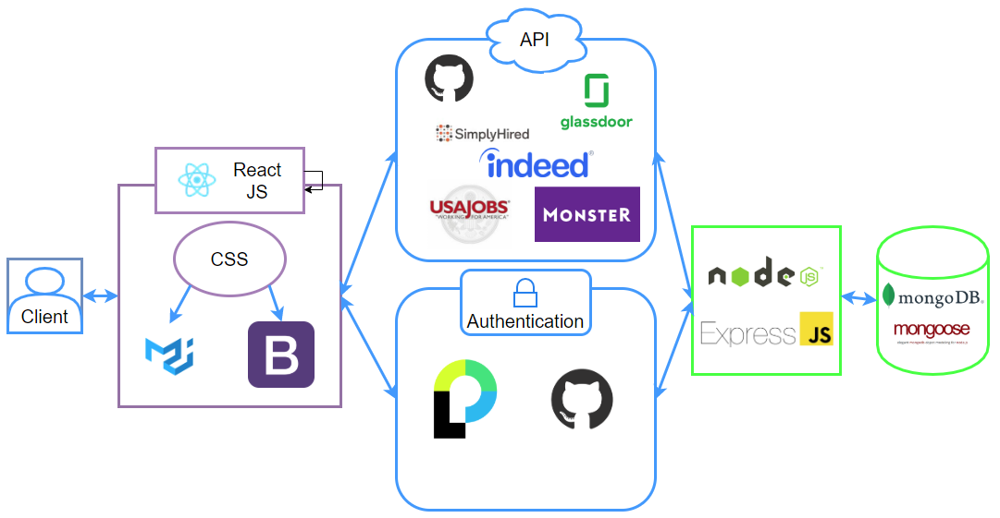
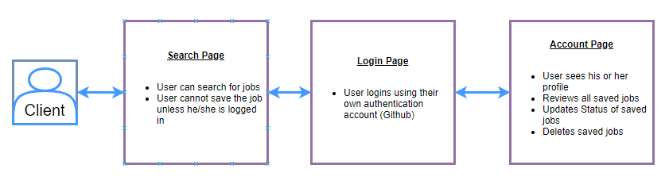

# Git Hire
[](LICENSE)


## What is this repo?
Have you ever struggled to keep up with all of the jobs that you applied to using excel or notebook to track all of the jobs? Are you tired of searching for jobs through different websites? Well, now you can search for jobs from different providers through Git-Hire. You can also manage the jobs that you have applied and and track the status of each job

This is a great learning tool for beginner software engineer to understand the concept of MERN Stack web application. It also provides a simple example of passportjs.

 
  

## How is this repo useful?
This is a great learning tool for MERN stack software engineer with the following concepts:

* Learn about MongoDB in Node js. 
    * [Mongodb package](https://www.npmjs.com/package/mongodb)
* Learn about Express JS.
    * [express package](https://www.npmjs.com/package/express)
* The script is written in Node JS.
    * [Node JS](https://nodejs.org/en/)
* Learn about Express-flash.
    * [express flash](https://www.npmjs.com/package/express-flash)
* Learn about Express-session.
    * [express session](https://www.npmjs.com/package/express-session)
* Learn about Mongoose.
    * [mongoose](https://www.npmjs.com/package/mongoose)
* Learn about passport.
    * [passport](https://www.npmjs.com/package/passport)
* Learn about cheerio.
    * [cheerio](https://www.npmjs.com/package/cheerio)
* Learn about passport-github.
    * [passport-github](https://www.npmjs.com/package/passport-github)
* Learn about React.
    * [react](https://www.npmjs.com/package/react)

## How to get Started?
1. clone the repository:
```git
git clone git@github.com:tmnguyen8/git-hire.git
```
* If your node js and npm installed, you can skip this step.
  * [Downloading and installing Node.js and npm](https://docs.npmjs.com/downloading-and-installing-node-js-and-npm)

2. Install the packages:
Navigate to your directory where this repo lives on your local machine and install the following packages:
```git
npm install
```

3. Get API Access Secret from USA Jobs:
* Get the API access from USA Jobs.
    * [USA Jobs Access Request](https://developer.usajobs.gov/APIRequest/Index)


4. Get Github OAuth App Secret from Github:
* Create an app and get your secrete.
    * [Github Developer](https://developer.github.com/apps/building-oauth-apps/authorizing-oauth-apps/)


## How does this work?
1. The user has the functionality to search for jobs based on title and location. The user can save the jobs and manage their status.

    [User Page](https://git-hire.herokuapp.com/)
    
[](https://www.youtube.com/watch?v=QGodbRNV_AE)
